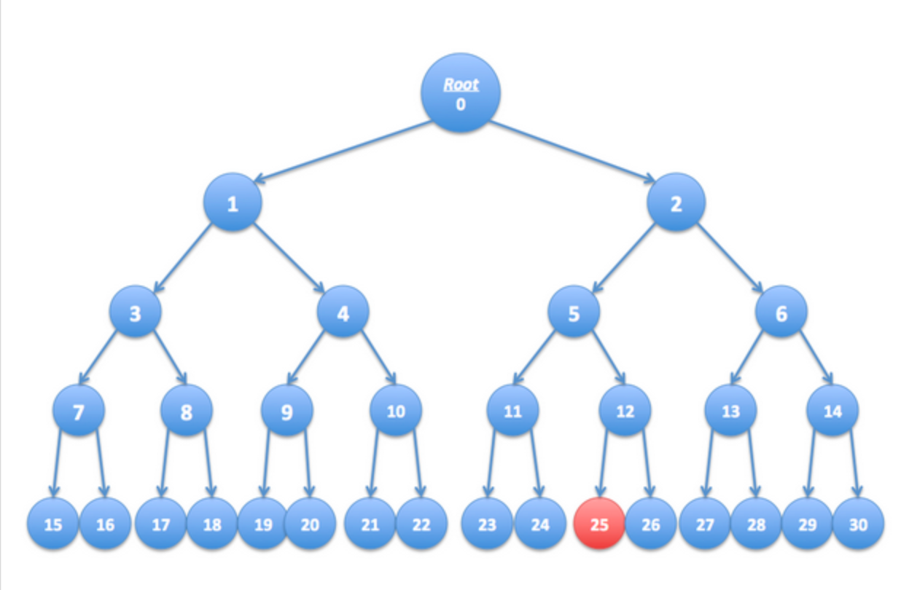

# 密码学 习题集 - 流密码

---

## 第 1 题（1 分）

数据压缩常用于数据存储和传输。假设你想将数据压缩与加密结合使用，以下哪种顺序更合理？

- [x] 先压缩，再加密
- [ ] 顺序无所谓——两者都不会压缩数据
- [ ] 先加密，再压缩
- [ ] 顺序无所谓——两种顺序都可以

---

## 第 2 题（1 分）

设 $G: \{0,1\}^s \to \{0,1\}^n$ 是一个安全的伪随机数生成器（PRG）。以下哪些也是安全的 PRG？（可能有多个正确答案）

- [ ] $G'(k) = G(0)$
- [x] $G'(k) = G(k \oplus 1^s)$
- [ ] $G'(k) = G(k) \| G(k)$（其中 $\|$ 表示拼接）
- [x] $G'(k) = G(k)[0, \ldots, n-2]$（即丢弃 $G(k)$ 的最后一位）
- [ ] $G'(k) = G(k) \| 0$（其中 $\|$ 表示拼接）
- [x] $G'(k) = G(k) \oplus 1^n$

---

## 第 3 题（1 分）

设 $G: K \to \{0,1\}^n$ 是一个安全的 PRG。

定义 $G'(k_1, k_2) = G(k_1) \wedge G(k_2)$，其中 $\wedge$ 为逐位与（AND）运算。

考虑如下对 $\{0,1\}^n$ 的统计测试 $A$：

$$A(x) \text{ 输出 } \mathrm{LSB}(x)$$

即输出 $x$ 的最低有效位。

请问 $\mathrm{Adv}_{\mathrm{PRG}}[A, G']$ 是多少？

> 假设恰好有一半的种子 $k \in K$ 使得 $\mathrm{LSB}(G(k)) = 0$。

**注意**：请将优势以 0 到 1 之间的小数输入，小数点前须有 0。例如优势为 3/4，则输入 0.75。

**答案：** ___0.25________

---
## 第 4 题（1 分）

设 $(E, D)$ 是一个（一次性）语义安全的密码，密钥空间为 $K = \{0,1\}^\ell$。一家银行希望将解密密钥 $k \in \{0,1\}^\ell$ 拆分为两份 $p_1$ 和 $p_2$，使得只有同时持有两份才能解密。

**背景说明（两份拆分）：**  
银行随机生成 $k_1 \in \{0,1\}^\ell$，并令 $k_1' \leftarrow k \oplus k_1$，则 $k_1 \oplus k_1' = k$。将 $k_1$ 交给一位高管，$k_1'$ 交给另一位，两人必须同时在场才能解密（单独持有任意一份都不含关于 $k$ 的任何信息）。

**本题（三份拆分）：**  
现在银行希望将 $k$ 拆分为三份 $p_1, p_2, p_3$，使得**任意两份**都足以解密。这样即使一位高管缺席，解密仍可进行。

为此，银行生成两对随机密钥 $(k_1, k_1')$ 和 $(k_2, k_2')$，满足：

$$k_1 \oplus k_1' = k_2 \oplus k_2' = k$$

请问银行应如何分配这些份额，使得任意两份可以恢复 $k$，但单独任意一份不能？

- [ ] $p_1 = (k_1,\, k_2),\quad p_2 = (k_1'),\quad p_3 = (k_2')$
- [ ] $p_1 = (k_1,\, k_2),\quad p_2 = (k_1,\, k_2),\quad p_3 = (k_2')$
- [x] $p_1 = (k_1,\, k_2),\quad p_2 = (k_1',\, k_2'),\quad p_3 = (k_2')$
- [ ] $p_1 = (k_1,\, k_2),\quad p_2 = (k_1',\, k_2),\quad p_3 = (k_2')$
- [ ] $p_1 = (k_1,\, k_2),\quad p_2 = (k_2,\, k_2'),\quad p_3 = (k_2')$

---

## 第 5 题（1 分）

设 $M = C = K = \{0, 1, 2, \ldots, 255\}$，考虑如下定义在 $(K, M, C)$ 上的密码：

$$E(k, m) = m + k \pmod{256}$$
$$D(k, c) = c - k \pmod{256}$$

该密码是否具有完美保密性（perfect secrecy）？

- [x] 是的。
- [ ] 不是，只有一次性密码本（OTP）具有完美保密性。
- [ ] 不是，该密码存在简单的攻击方式。

---

## 第 6 题（1 分）

设 $(E, D)$ 是一个（一次性）语义安全的密码，消息空间和密文空间均为 $\{0,1\}^n$。以下哪些加密方案是（一次性）语义安全的？

- [ ] $E'(k, m) = E(k, m) \| \mathrm{LSB}(m)$
- [x] $E'(k, m) = \mathrm{reverse}(E(k, m))$（翻转密文的比特顺序）
- [ ] $E'(k, m) = E(k, m) \| k$
- [x] $E'(k, m) = 0 \| E(k, m)$（在密文前添加比特 0）
- [ ] $E'((k, k'),\, m) = E(k, m) \| E(k', m)$
- [ ] $E'(k, m) = E(0^n, m)$

---

## 第 7 题（1 分）

假设你知道消息 "attack at dawn" 的一次性密码本（OTP）加密结果为：

```
6c73d5240a948c86981bc294814d
```

（明文字母用 8 位 ASCII 编码，密文以十六进制表示）

请问在**相同 OTP 密钥**下，消息 "attack at dusk" 的加密结果是什么？

**答案：** _6c73d5240a948c86981bc2da137c__________

---

## 第 8 题（1 分）

电影行业希望保护 DVD 上分发的数字内容，以下描述了一种类似于蓝光盘保护方案 AACS 的变体。

**系统设定：**  
假设全球最多有 $n$ 台 DVD 播放器（例如 $n = 2^{32}$）。将这 $n$ 台播放器视为一棵高度为 $\log_2 n$ 的**二叉树**的叶节点。树中每个节点包含一个 AES 密钥 $k_i$，这些密钥对消费者保密且永久固定。

制造时，每台播放器被分配序号 $i \in [0, n-1]$，并被嵌入从根节点到叶节点 $i$ 路径 $S_i$ 上所有节点对应的密钥。

一部 DVD 电影 $m$ 被加密为：

$$E(k_{\text{root}},\, k) \;\|\; E(k, m)$$

其中 $k$ 是随机生成的内容密钥，$k_{\text{root}}$ 是根节点密钥。由于所有播放器都有 $k_{\text{root}}$，所有播放器均可解密电影。

**密钥撤销：**  
假设播放器 $r$ 的密钥被黑客窃取并公开于互联网。在发行新 DVD 时，电影行业可以使用一个稍大的包头（约含 $\log_2 n$ 个密文），使得**除播放器 $r$ 之外**的所有播放器均可解密该电影，从而"禁用"播放器 $r$。

**本题：**  
如下图所示，考虑一棵有 $n = 16$ 个叶节点的树。假设标号为 **25** 的叶节点对应于被暴露的播放器密钥。请选择应在哪些节点的密钥下加密内容密钥 $k$，使得除播放器 25 以外的所有播放器均可解密 DVD。

> 📌 **注意**：需要恰好 **4 个**密钥。



- [x] 9
- [ ] 1
- [ ] 28
- [ ] 6
- [x] 20
- [ ] 19
- [x] 26
- [x] 11

---

## 第 9 题（1 分）

接续第 8 题，若共有 $n$ 台 DVD 播放器，当恰好**一台**播放器的密钥需要被撤销时，内容密钥 $k$ 需要在多少个密钥下进行加密？

- [ ] $\sqrt{n}$
- [ ] $n/2$
- [ ] $n - 1$
- [ ] $2$
- [x] $\log_2 n$

---

## 第 10 题（1 分）

接续第 8 题，假设标号为 **16、18、25** 的叶节点对应于被暴露的播放器密钥。请选择最小的密钥集合，在这些密钥下加密内容密钥 $k$，使得除播放器 16、18、25 以外的所有播放器均可解密 DVD。

> 📌 **注意**：需要恰好 **6 个**密钥。

- [x] 4
- [x] 6
- [ ] 11
- [x] 15
- [x] 17
- [x] 26
- [ ] 12
- [ ] 9
- [x] 28
- [ ] 19

---

## 第 11 题（1 分）

假设字母表包含 26 个字母，替换密码（Substitution Cipher）的密钥空间大小是多少？

- [ ] $|\mathcal{K}| = 26$
- [x] $|\mathcal{K}| = 26!$（26 的阶乘）
- [ ] $|\mathcal{K}| = 2^{26}$
- [ ] $|\mathcal{K}| = 26^2$

---

## 第 12 题（1 分）

在英文文本中，出现频率最高的字母是哪个？

- [ ] "X"
- [ ] "L"
- [x] "E"
- [ ] "H"

---

## 第 13 题（1 分）

**复习：异或（XOR）运算**

$\{0,1\}^n$ 中两个字符串的异或（XOR）是它们的逐位模 2 加法。

请计算：$0110111 \oplus 1011010 = ?$

**答案：** _11011001__________

---

## 第 14 题（1 分）

**异或的一个重要性质**

**定理**：设 $Y$ 是 $\{0,1\}^n$ 上的随机变量，$X$ 是 $\{0,1\}^n$ 上**独立的**均匀随机变量。则 $Z := Y \oplus X$ 在 $\{0,1\}^n$ 上是均匀分布的。

**问题**：该定理说明了什么？

- [ ] $Y \oplus X$ 的分布取决于 $Y$ 的分布
- [x] 任何随机变量与独立的均匀随机变量异或后，结果仍是均匀分布
- [ ] $X$ 和 $Y$ 必须同分布
- [ ] 异或运算不改变分布

---

## 第 15 题（1 分）

给定一条消息 $m$ 及其 OTP（一次性密码本）加密后的密文 $c$。  
你能从 $m$ 和 $c$ 计算出 OTP 密钥吗？

- [ ] 不能，我无法计算出密钥。
- [x] 能，密钥是 $k = m \oplus c$。
- [ ] 我只能计算出密钥的一半比特。
- [ ] 能，密钥是 $k = m \oplus m$。

---

## 第 16 题（1 分）

设 $m \in \mathcal{M}$，$c \in \mathcal{C}$。  
有多少个 OTP 密钥可以将 $m$ 映射到 $c$？

- [ ] 无
- [x] 1
- [ ] 2
- [ ] 取决于 $m$

---

## 第 17 题（1 分）

流密码（Stream Cipher）能否具有完美保密性（Perfect Secrecy）？

- [x] 是的，如果 PRG 真的是"安全"的
- [ ] 不能，不存在具有完美保密性的密码
- [ ] 是的，每个密码都具有完美保密性
- [ ] 不能，因为密钥比消息短

---

## 第 18 题（1 分）

假设 $G: K \to \{0,1\}^n$ 满足对所有 $k$ 都有：$\text{XOR}(G(k)) = 1$（即 $G(k)$ 所有比特的异或结果为 1）。

问：$G$ 是否可预测？

- [ ] 是的，给定第一个比特我可以预测第二个
- [ ] 不可预测，$G$ 是不可预测的
- [x] 是的，给定前 $(n-1)$ 个比特我可以预测第 $n$ 个比特
- [ ] 视情况而定

---

## 第 19 题（1 分）

设 $G: K \to \{0,1\}^n$ 是一个 PRG，满足：从 $G(k)$ 的后 $n/2$ 个比特可以很容易地计算出前 $n/2$ 个比特。

问：$G$ 对于某个 $i \in \{0, \ldots, n-1\}$ 是否可预测？

- [x] 是
- [ ] 否

---

## 第 20 题（问答/证明题，3 分）

**PRG 优势（Advantage）的定义与计算**

设 $G: K \to \{0,1\}^n$ 是一个 PRG，$A$ 是 $\{0,1\}^n$ 上的统计测试。

**(a)** 请写出 PRG 优势 $\mathrm{Adv}_{\mathrm{PRG}}[A, G]$ 的定义式。

**答案：**

```
 2. 标准定义式
PRG 优势衡量的是**区分器 $A$ 区分 PRG 输出 $G(k)$ 与真随机序列 $U_n$ 的能力**，其标准定义为：

$$
\boxed{
\mathbf{Adv_{PRG}[A, G]} = \left| \Pr_{k \stackrel{\$}{\gets} K} \left[ A(G(k)) = 1 \right] - \Pr_{r \stackrel{\$}{\gets} \{0,1\}^n} \left[ A(r) = 1 \right] \right|
}
$$
```

**(b)** 解释 $\mathrm{Adv}_{\mathrm{PRG}}[A, G]$ 接近 1 和接近 0 分别意味着什么。

**答案：**

```
 PRG 优势 $\mathbf{Adv_{PRG}[A, G]}$ 接近 1 和 0 的含义解析

---

#### 1. 核心定义回顾
PRG 优势衡量的是**区分器 $A$ 区分 PRG 输出 $G(k)$ 与真随机序列 $U_n$ 的能力**，公式为：
$$
\mathbf{Adv_{PRG}[A, G]} = \left| \Pr_{k \stackrel{\$}{\gets} K} \left[ A(G(k)) = 1 \right] - \Pr_{r \stackrel{\$}{\gets} \{0,1\}^n} \left[ A(r) = 1 \right] \right|
$$
其中：
- $A(G(k))=1$：区分器判定输入为「真随机」
- $A(r)=1$：区分器对真随机序列判定为「真随机」的基准概率

---

#### 2. 优势接近 1 的含义 
当 $\mathbf{Adv_{PRG}[A, G] \approx 1}$ 时：
- 区分器 $A$ 能**以极高的准确率**区分 PRG 输出和真随机序列
- 说明 PRG $G$ 的输出存在**明显的非随机特征**（如固定模式、统计偏差、可预测性），与真随机序列差异极大
- 结论：**该 PRG 完全不安全，已被攻破**，无法用于密码学场景

---

#### 3. 优势接近 0 的含义 
当 $\mathbf{Adv_{PRG}[A, G] \approx 0}$ 时：
- 区分器 $A$ 无法区分 PRG 输出和真随机序列，猜测准确率与随机瞎猜无异
- 说明 PRG $G$ 的输出在统计特性上**与真随机序列几乎完全一致**，不存在可被利用的非随机特征
- 结论：**该 PRG 是安全的**，满足密码学中伪随机生成器的安全性要求

---
```

**(c)** 若 $A(x) = 0$（即 $A$ 对任何输入都输出 0），求 $\mathrm{Adv}_{\mathrm{PRG}}[A, G]$ 的值。

**答案：**

```
0
```

---

## 第 21 题（问答/证明题，4 分）

**PRG 优势的具体计算**

假设 $G: K \to \{0,1\}^n$ 满足：对于 $K$ 中 $\frac{2}{3}$ 的密钥 $k$，有 $\mathrm{MSB}(G(k)) = 1$（即输出的最高有效位为 1）。

定义统计测试 $A(x)$ 如下：
$$A(x) = \begin{cases} 1 & \text{若 } \mathrm{MSB}(x) = 1 \\ 0 & \text{否则} \end{cases}$$

**(a)** 计算 $\Pr[A(G(k)) = 1]$，其中 $k \xleftarrow{R} K$。

**答案：**

```
2/3
```

**(b)** 计算 $\Pr[A(r) = 1]$，其中 $r \xleftarrow{R} \{0,1\}^n$。

**答案：**

```
1/2
```

**(c)** 计算 $\mathrm{Adv}_{\mathrm{PRG}}[A, G]$。

**答案：**

```
1/6
```

**(d)** 该 PRG 是否安全？为什么？

**答案：**

```
该 PRG 不安全。
2. 不安全的原因 • 统计偏差：该 PRG 的输出最高有效位（MSB）为 1 的概率是 2/3  ，而真随机序列的 MSB 为 1 的概率是  1/2 ，存在明显的统计偏差。 • 可区分性：区分器    仅通过检测最高有效位，就能有效区分 PRG 输出和真随机序列，说明 PRG 的输出不具备伪随机性，无法满足密码学安全要求。  3. 安全 PRG 的标准 一个安全的 PRG 要求：对于所有多项式时间的区分器，其优势都是可忽略的（无限接近 0）。该 PRG 存在不可忽略的优势，因此是不安全的。
```

---

## 第 22 题（证明题，5 分）

**证明 OTP 具有完美保密性**

**引理**：一次性密码本（OTP）具有完美保密性（Perfect Secrecy）。

**(a)** 写出完美保密性的定义：对于任意明文 $m$ 和密文 $c$，$\Pr_k[E(k,m) = c]$ 应满足什么条件？

**答案：**

```
### 证明：加密方案 $\mathbb{E} = (E,D)$ 不是语义安全的

---

#### 1. 语义安全性的定义回顾
一个加密方案 $\mathbb{E} = (E,D)$ 是**语义安全**的，当且仅当：
对于任意两个等长明文 $m_0, m_1$，任意多项式时间的敌手 $A$，都无法以显著高于 $1/2$ 的概率，从密文 $c = E(k, m_b)$（$b \in \{0,1\}$ 随机选取）中区分出 $b$ 的值。
换句话说，密文不能泄露任何关于明文的**有效信息**。

---

#### 2. 构造区分器（敌手）$A$
题目给出：存在高效算法 $A$，对任意密文 $c$，总能从 $c$ 中推断出对应明文 $m$ 的最低有效位 $\text{LSB}(m)$。
我们构造如下区分器 $A'$：
1.  敌手收到挑战密文 $c^* = E(k, m_b)$，其中 $m_0, m_1$ 是两个满足 $\text{LSB}(m_0) \neq \text{LSB}(m_1)$ 的等长明文（例如 $m_0=0, m_1=1$）。
2.  敌手调用算法 $A$，从 $c^*$ 中计算出 $\text{LSB}(m_b)$。
3.  若计算结果等于 $\text{LSB}(m_0)$，则判定 $b=0$；否则判定 $b=1$。

---

#### 3. 证明区分器的优势不可忽略
根据题设，算法 $A$ 对任意密文都能**正确**推断出 $\text{LSB}(m)$，因此区分器 $A'$ 的判定准确率为 $100\%$，其优势为：
$$
\mathbf{Adv} = \left| \Pr[A'(c^*) = b] - \frac{1}{2} \right| = \left| 1 - \frac{1}{2} \right| = \frac{1}{2}
$$
该优势**不可忽略**，说明存在多项式时间的敌手，能从密文中有效区分明文，违反了语义安全性的定义。

---

#### 4. 结论
由于密文 $c$ 泄露了明文 $m$ 的最低有效位这一有效信息，存在可区分明文的高效敌手，因此加密方案 $\mathbb{E} = (E,D)$ **不是语义安全的**。

```

**(b)** 对于 OTP，证明对任意 $m \in \mathcal{M}$ 和 $c \in \mathcal{C}$，恰好存在多少个密钥 $k$ 使得 $E(k, m) = c$？

**答案：**

```
### 攻击者 $B$ 的构造方案

---

#### 1. 选择两条消息 $m_0, m_1$
攻击者 $B$ 选择两条**等长**、且**最低有效位不同**的消息，例如：
- $m_0 = 0$（二进制：$\dots0$，$\text{LSB}(m_0)=0$）
- $m_1 = 1$（二进制：$\dots1$，$\text{LSB}(m_1)=1$）

将这两条消息发送给挑战者，等待挑战密文 $c^*$。

---

#### 2. 收到密文 $c$ 后，猜测 $b$ 的步骤
1.  攻击者 $B$ 调用题目给定的算法 $A$，将挑战密文 $c^*$ 作为输入。
2.  算法 $A$ 输出对应明文的最低有效位 $\text{LSB}(m_b)$。
3.  $B$ 进行判断：
    - 若 $\text{LSB}(m_b) = 0$，则判定 $b=0$（对应消息 $m_0$）
    - 若 $\text{LSB}(m_b) = 1$，则判定 $b=1$（对应消息 $m_1$）

---

#### 3. 方案有效性说明
根据题设，算法 $A$ 对任意密文都能**100%正确**推断出明文的最低有效位，因此攻击者 $B$ 的猜测准确率为 $100\%$，优势为 $\frac{1}{2}$，完美赢得语义安全游戏。

---

### 核心逻辑
该攻击的本质是：利用密文泄露的明文最低有效位这一信息，构造两个LSB不同的明文，从而通过子算法 $A$ 直接区分密文对应的明文，破环语义安全性。
```

**(c)** 利用 (a) 和 (b) 的结论，完成 OTP 具有完美保密性的证明。

**答案：**

```
1/2
```

---

## 第 23 题（证明题，5 分）

**语义安全性与明文信息泄露**

假设存在一个高效算法 $A$，它总是能从密文 $c$ 中推断出明文 $m$ 的最低有效位 $\mathrm{LSB}(m)$。

**(a)** 请证明：加密方案 $\mathbb{E} = (E, D)$ 不是语义安全的。

**答案：**

```
### 证明：在 $\mathbf{EXP(0)}$ 中，密文 $\mathbf{c = k \oplus m_0}$ 在 $\{0,1\}^n$ 上均匀分布

---

#### 1. 前提条件与变量定义
- 密钥 $k$ 服从 $\{0,1\}^n$ 上的**均匀分布**，即 $k \xleftarrow{R} \{0,1\}^n$。
- 明文 $m_0$ 是固定的已知字符串，且 $|m_0| = n$。
- 密文 $c = k \oplus m_0$，其中 $\oplus$ 表示按位异或运算。

---

#### 2. 证明过程（双射/置换性质）
**步骤1：构造一一对应关系**
对于任意固定的 $m_0$，定义映射 $f: \{0,1\}^n \to \{0,1\}^n$，满足：
$$ f(k) = k \oplus m_0 $$

**步骤2：证明 $f$ 是一个置换（Permutation）**
- **单射（Injective）**：若 $f(k_1) = f(k_2)$，则 $k_1 \oplus m_0 = k_2 \oplus m_0$。两边同时异或 $m_0$，得 $k_1 = k_2$。
- **满射（Surjective）**：对于任意目标密文 $c \in \{0,1\}^n$，总能找到唯一的密钥 $k = c \oplus m_0$，使得 $f(k) = c$。

由于 $f$ 既是单射又是满射，因此它是**双射**。这意味着对于每一个输出 $c$，都有且仅有一个输入 $k$ 与之对应。

**步骤3：推导概率分布**
根据概率的**拉回变换（Pullback）**性质：
$$ \Pr_{k}[c = x] = \Pr_{k}[k \oplus m_0 = x] = \Pr_{k}[k = x \oplus m_0] $$

因为 $k$ 在 $\{0,1\}^n$ 上均匀分布，所以对于任意 $x$，有：
$$ \Pr_{k}[k = x \oplus m_0] = \frac{1}{2^n} $$

---

#### 3. 结论
由于对于任意 $x \in \{0,1\}^n$，密文 $c$ 取 $x$ 的概率恒为 $\frac{1}{2^n}$，因此：
**密文 $c = k \oplus m_0$ 在 $\{0,1\}^n$ 上是均匀分布的。**


```

**(b)** 构造一个攻击者 $B$，使用 $A$ 作为子程序来赢得语义安全游戏。具体地：
   - 攻击者 $B$ 应选择哪两条消息 $m_0, m_1$ 发送给挑战者？
   - 收到密文 $c$ 后，$B$ 如何利用 $A$ 来猜测 $b$？

**答案：**

```
### 证明：在 $\mathbf{EXP(1)}$ 中，密文 $\mathbf{c = k \oplus m_1}$ 在 $\{0,1\}^n$ 上均匀分布

---

#### 1. 前提条件
- 密钥 $k$ 服从 $\{0,1\}^n$ 上的**均匀分布**，即 $k \xleftarrow{R} \{0,1\}^n$。
- 明文 $m_1$ 是固定的已知字符串，且 $|m_1| = n$。
- 密文 $c = k \oplus m_1$，$\oplus$ 为按位异或运算。

---

#### 2. 证明过程
**步骤1：定义映射**
对任意固定的 $m_1$，定义映射 $g: \{0,1\}^n \to \{0,1\}^n$：
$$ g(k) = k \oplus m_1 $$

**步骤2：证明 $g$ 是双射（置换）**
- **单射**：若 $g(k_1) = g(k_2)$，则 $k_1 \oplus m_1 = k_2 \oplus m_1$，两边同时异或 $m_1$ 得 $k_1 = k_2$，故单射成立。
- **满射**：对任意目标密文 $c \in \{0,1\}^n$，取唯一密钥 $k = c \oplus m_1$，则 $g(k) = c$，故满射成立。

因此 $g$ 是 $\{0,1\}^n$ 到自身的**双射**（置换）。

**步骤3：推导概率分布**
对任意 $x \in \{0,1\}^n$：
$$
\Pr_{k}[c = x] = \Pr_{k}[k \oplus m_1 = x] = \Pr_{k}[k = x \oplus m_1]
$$
由于 $k$ 均匀分布，$\Pr_{k}[k = x \oplus m_1] = \frac{1}{2^n}$，因此对任意 $x$，$\Pr[c=x] = \frac{1}{2^n}$。

---

#### 3. 结论
密文 $c = k \oplus m_1$ 在 $\{0,1\}^n$ 上**均匀分布**，与 $\text{EXP}(0)$ 中 $c = k \oplus m_0$ 的分布完全相同。

```

**(c)** 计算 $\mathrm{Adv}_{\mathrm{SS}}[B, \mathbb{E}]$ 的值。

**答案：**

```
### 证明：$\mathbf{EXP(0)}$ 与 $\mathbf{EXP(1)}$ 中密文分布完全相同

---

#### 1. 由(a)(b)的结论直接推导
- 在 $\text{EXP(0)}$ 中，密文 $c_0 = k \oplus m_0$，我们已证明其在 $\{0,1\}^n$ 上**均匀分布**，即对任意 $x \in \{0,1\}^n$，$\Pr[c_0 = x] = \frac{1}{2^n}$。
- 在 $\text{EXP(1)}$ 中，密文 $c_1 = k \oplus m_1$，同理可证其在 $\{0,1\}^n$ 上**均匀分布**，即对任意 $x \in \{0,1\}^n$，$\Pr[c_1 = x] = \frac{1}{2^n}$。

#### 2. 分布相同的结论
两个随机变量的分布完全相同，当且仅当它们在所有可能取值上的概率完全相等。
由于 $c_0$ 和 $c_1$ 对任意 $x \in \{0,1\}^n$ 的取值概率均为 $\frac{1}{2^n}$，因此：
**$\text{EXP(0)}$ 与 $\text{EXP(1)}$ 中密文的分布完全相同（identical distributions）**。

```

---

## 第 24 题（证明题，5 分）

**证明 OTP 是语义安全的**

考虑语义安全游戏的两个实验：
- **EXP(0)**：挑战者加密 $m_0$，即 $c \leftarrow k \oplus m_0$
- **EXP(1)**：挑战者加密 $m_1$，即 $c \leftarrow k \oplus m_1$

其中 $k \xleftarrow{R} K$，$|m_0| = |m_1|$。

**(a)** 证明在 EXP(0) 中，密文 $c = k \oplus m_0$ 在 $\{0,1\}^n$ 上是均匀分布的。

**答案：**

```
### 证明：在 $\mathbf{EXP(0)}$ 中，密文 $\mathbf{c = k \oplus m_0}$ 在 $\{0,1\}^n$ 上均匀分布

---

#### 1. 前提条件与变量定义
- 密钥 $k$ 服从 $\{0,1\}^n$ 上的**均匀分布**，即 $k \xleftarrow{R} \{0,1\}^n$。
- 明文 $m_0$ 是固定的已知字符串，且 $|m_0| = n$。
- 密文 $c = k \oplus m_0$，其中 $\oplus$ 表示按位异或运算。

---

#### 2. 证明过程（双射/置换性质）
**步骤1：构造一一对应关系**
对于任意固定的 $m_0$，定义映射 $f: \{0,1\}^n \to \{0,1\}^n$，满足：
$$ f(k) = k \oplus m_0 $$

**步骤2：证明 $f$ 是一个置换（Permutation）**
- **单射（Injective）**：若 $f(k_1) = f(k_2)$，则 $k_1 \oplus m_0 = k_2 \oplus m_0$。两边同时异或 $m_0$，得 $k_1 = k_2$。
- **满射（Surjective）**：对于任意目标密文 $c \in \{0,1\}^n$，总能找到唯一的密钥 $k = c \oplus m_0$，使得 $f(k) = c$。

由于 $f$ 既是单射又是满射，因此它是**双射**。这意味着对于每一个输出 $c$，都有且仅有一个输入 $k$ 与之对应。

**步骤3：推导概率分布**
根据概率的**拉回变换（Pullback）**性质：
$$ \Pr_{k}[c = x] = \Pr_{k}[k \oplus m_0 = x] = \Pr_{k}[k = x \oplus m_0] $$

因为 $k$ 在 $\{0,1\}^n$ 上均匀分布，所以对于任意 $x$，有：
$$ \Pr_{k}[k = x \oplus m_0] = \frac{1}{2^n} $$

---

#### 3. 结论
由于对于任意 $x \in \{0,1\}^n$，密文 $c$ 取 $x$ 的概率恒为 $\frac{1}{2^n}$，因此：
**密文 $c = k \oplus m_0$ 在 $\{0,1\}^n$ 上是均匀分布的。**

```

**(b)** 证明在 EXP(1) 中，密文 $c = k \oplus m_1$ 在 $\{0,1\}^n$ 上也是均匀分布的。

**答案：**

```
### 证明：在 $\mathbf{EXP(1)}$ 中，密文 $\mathbf{c = k \oplus m_1}$ 在 $\{0,1\}^n$ 上均匀分布

---

#### 1. 前提条件
- 密钥 $k$ 服从 $\{0,1\}^n$ 上的**均匀分布**，即 $k \xleftarrow{R} \{0,1\}^n$。
- 明文 $m_1$ 是固定的已知字符串，且 $|m_1| = n$。
- 密文 $c = k \oplus m_1$，$\oplus$ 为按位异或运算。

---

#### 2. 证明过程
**步骤1：定义映射**
对任意固定的 $m_1$，定义映射 $g: \{0,1\}^n \to \{0,1\}^n$：
$$ g(k) = k \oplus m_1 $$

**步骤2：证明 $g$ 是双射（置换）**
- **单射**：若 $g(k_1) = g(k_2)$，则 $k_1 \oplus m_1 = k_2 \oplus m_1$，两边同时异或 $m_1$ 得 $k_1 = k_2$，故单射成立。
- **满射**：对任意目标密文 $c \in \{0,1\}^n$，取唯一密钥 $k = c \oplus m_1$，则 $g(k) = c$，故满射成立。

因此 $g$ 是 $\{0,1\}^n$ 到自身的**双射**（置换）。

**步骤3：推导概率分布**
对任意 $x \in \{0,1\}^n$：
$$
\Pr_{k}[c = x] = \Pr_{k}[k \oplus m_1 = x] = \Pr_{k}[k = x \oplus m_1]
$$
由于 $k$ 均匀分布，$\Pr_{k}[k = x \oplus m_1] = \frac{1}{2^n}$，因此对任意 $x$，$\Pr[c=x] = \frac{1}{2^n}$。

---

#### 3. 结论
密文 $c = k \oplus m_1$ 在 $\{0,1\}^n$ 上**均匀分布**，与 $\text{EXP}(0)$ 中 $c = k \oplus m_0$ 的分布完全相同。


```

**(c)** 由 (a) 和 (b) 说明 EXP(0) 和 EXP(1) 中密文的分布是相同的（identical distributions）。

**答案：**

```
### 证明：$\mathbf{EXP(0)}$ 与 $\mathbf{EXP(1)}$ 中密文分布完全相同

---

#### 1. 由(a)(b)的结论直接推导
- 在 $\text{EXP(0)}$ 中，密文 $c_0 = k \oplus m_0$，我们已证明其在 $\{0,1\}^n$ 上**均匀分布**，即对任意 $x \in \{0,1\}^n$，$\Pr[c_0 = x] = \frac{1}{2^n}$。
- 在 $\text{EXP(1)}$ 中，密文 $c_1 = k \oplus m_1$，同理可证其在 $\{0,1\}^n$ 上**均匀分布**，即对任意 $x \in \{0,1\}^n$，$\Pr[c_1 = x] = \frac{1}{2^n}$。

#### 2. 分布相同的结论
两个随机变量的分布完全相同，当且仅当它们在所有可能取值上的概率完全相等。
由于 $c_0$ 和 $c_1$ 对任意 $x \in \{0,1\}^n$ 的取值概率均为 $\frac{1}{2^n}$，因此：
**$\text{EXP(0)}$ 与 $\text{EXP(1)}$ 中密文的分布完全相同（identical distributions）**。

```

**(d)** 利用 (c) 的结论，证明对于任意攻击者 $A$：
$$\mathrm{Adv}_{\mathrm{SS}}[A, \mathrm{OTP}] = \left| \Pr[A(k \oplus m_0) = 1] - \Pr[A(k \oplus m_1) = 1] \right| = 0$$

**答案：**

```
### 证明：$\mathbf{Adv_{SS}[A, \text{OTP}] = 0}$

---

#### 1. 核心依据
由步骤(c)的结论可知：
- $\text{EXP(0)}$ 中密文 $c_0 = k \oplus m_0$ 与 $\text{EXP(1)}$ 中密文 $c_1 = k \oplus m_1$ 的分布**完全相同**，均为 $\{0,1\}^n$ 上的均匀分布。

#### 2. 概率推导
对于任意攻击者 $A$：
- $\Pr[A(k \oplus m_0) = 1]$：$A$ 对 $\text{EXP(0)}$ 密文输出 $1$ 的概率
- $\Pr[A(k \oplus m_1) = 1]$：$A$ 对 $\text{EXP(1)}$ 密文输出 $1$ 的概率

由于两个实验的密文分布完全一致，攻击者 $A$ 无法区分输入来自哪个实验，因此两个概率**必然相等**：
$$
\Pr[A(k \oplus m_0) = 1] = \Pr[A(k \oplus m_1) = 1]
$$

#### 3. 代入优势公式
语义安全优势定义为：
$$
\mathbf{Adv_{SS}[A, \text{OTP}]} = \left| \Pr[A(k \oplus m_0) = 1] - \Pr[A(k \oplus m_1) = 1] \right|
$$
将概率相等的结论代入，得：
$$
\mathbf{Adv_{SS}[A, \text{OTP}]} = |p - p| = 0
$$

---

### 结论
对于任意攻击者 $A$，OTP 的语义安全优势恒为 $0$，证明了一次性密码本是**信息论安全**的加密方案，满足完美语义安全。
```


